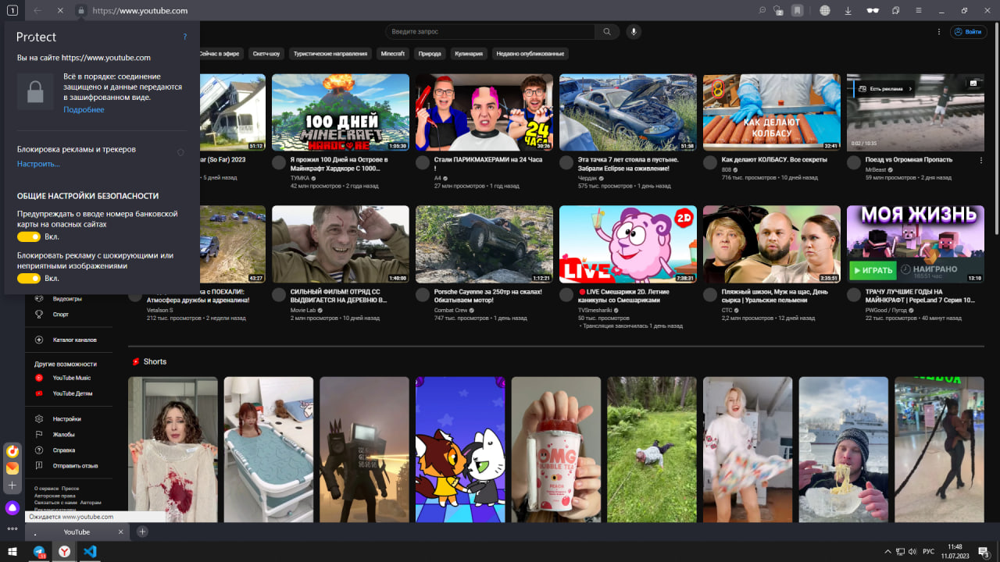

1. Определите, на каком протоколе работает сайт youtube.com.

Скриншот для первого задания представлен отдельным файлом *1_protocol.jpg*,  а так же, приложен в данном файле к первому заданию

Какие выводы можно сделать исходя из скриншота? О варианте протокола, с кторым работает сайт _youtube.com_
На скриншот,  в левом верхнем углу мы видим "замочек" и *https*, что позволяет нам сделать вывод о том, что сайт работает с защищенным, SSL_сертификатом, протоколом передачи данных в интернете.