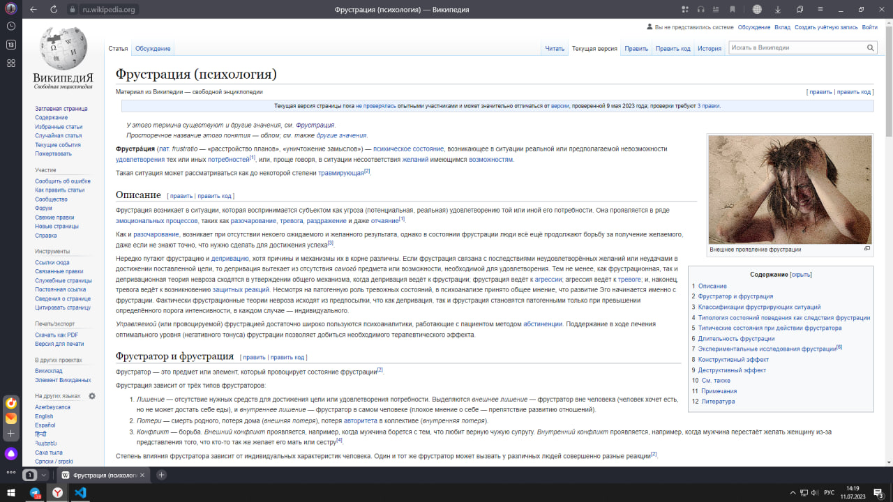
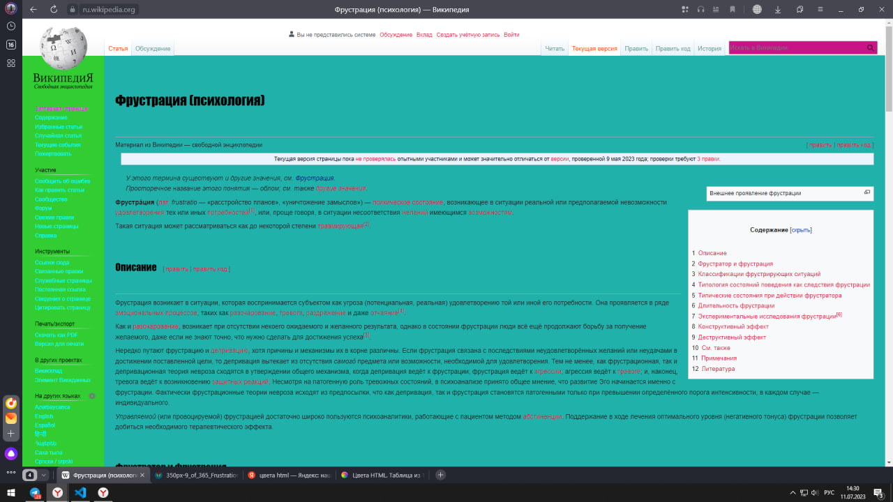

3. Внесите не менее 10 изменений на страницу любой статьи сайта https://ru.wikipedia.org/, с помощью инструмента разработчика и представьте два скриншота было/стало (скриншоты должны иметь названия 3_before.jpg, 3_after.jpg соответственно). Желательно поработать с изменением текста на странице, заменой картинки, изменением стилей.

Что было до - можно найти:

Что было после

Что было изменено:
1. Цвет бокового меню
2. Цвет "заглавная страница" в боковом меню
3. Цвет всех доп. вкладок в боковом меню
4. Цвет всех основных вкладок в боковом меню
5. Убрана картинка
6. Сменен цвет фона
7. Сменен цвет фона поиска
8. Перемещены вкладки в шапке к центру
9. Изменен шрифт подзаголовков, а так же размерность до и после них
10. Изменен шрифт ссылок в статье
11. Изменен йвет Вкладок в верхнем меню